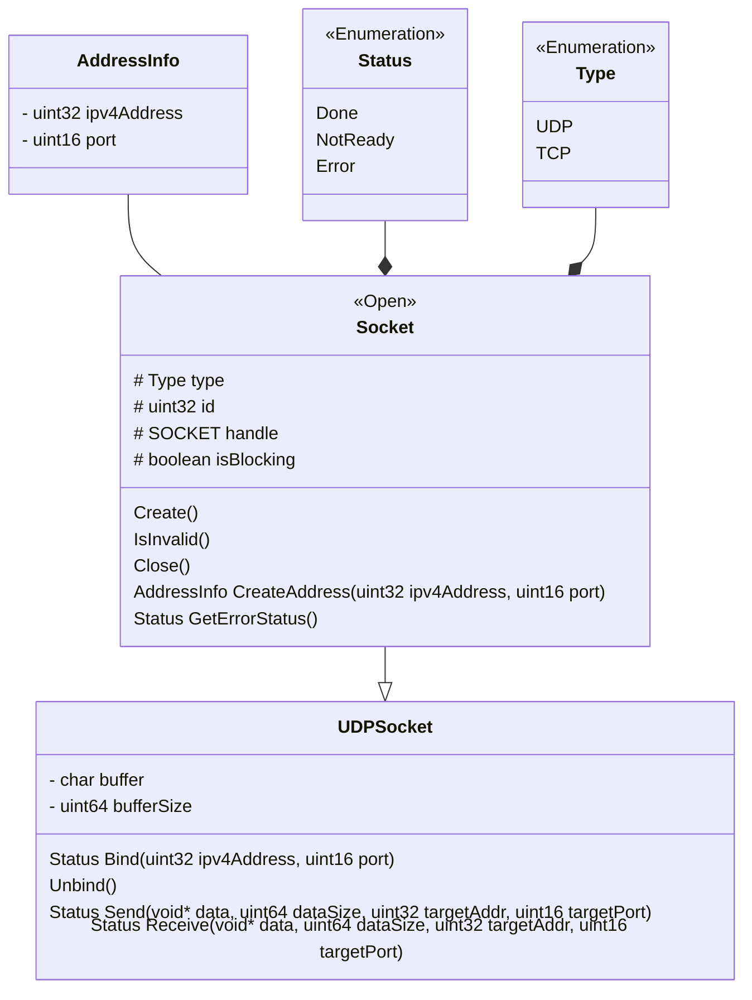

# UDP TestBed

Testing abstraction for using UDP as part of a networked application.

<h3>Architecture</h3>

```mermaid
classDiagram
  direction BT

  class AddressInfo {
    - uint32 ipv4Address
    - uint16 port
  }

  class Socket {
    <<Open>>
    # Type type
    # uint32 id
    # SOCKET handle
    # boolean isBlocking

    Create()
    IsInvalid()
    Close()

    AddressInfo CreateAddress(uint32 ipv4Address, uint16 port)
    Status GetErrorStatus()
  }

  class Status {
    <<Enumeration>>
    Done
    NotReady
    Error
  }

  class Type {
    <<Enumeration>>
    UDP
    TCP
  }

  class UDPSocket {
    - char buffer
    - uint64 bufferSize

    Status Bind(uint32 ipv4Address, uint16 port)
    Unbind()
    Status Send(void* data, uint64 dataSize, uint32 targetAddr, uint16 targetPort)
    Status Receive(void* data, uint64 dataSize, uint32 targetAddr, uint16 targetPort)
  }


  %% Define Relationships
  Socket      --    AddressInfo
  Socket      *--   Status
  Socket      *--   Type
  UDPSocket   <|--  Socket

```